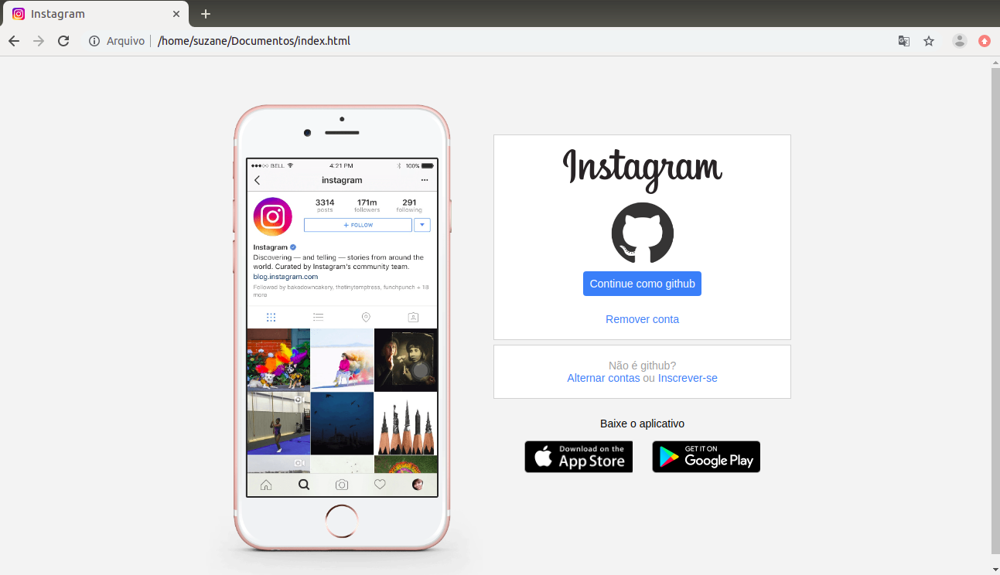

# Recriando a página inicial do Instagram :camera:

Este projeto apresenta uma recriação da página inicial do Instagram, abordando conceitos sobre CSS Flexbox e responsividade. Este é um desafio de projeto da Digital Innovation One no bootcamp HTML Web Developer.

## :gear: Tecnologias

- HTML5
- CSS3

## :art: Layout

